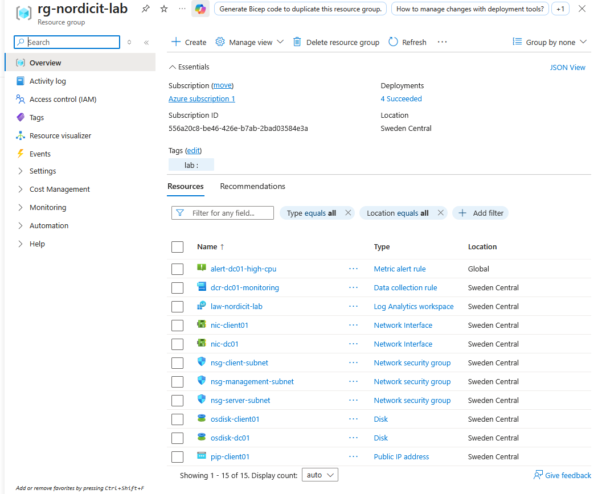
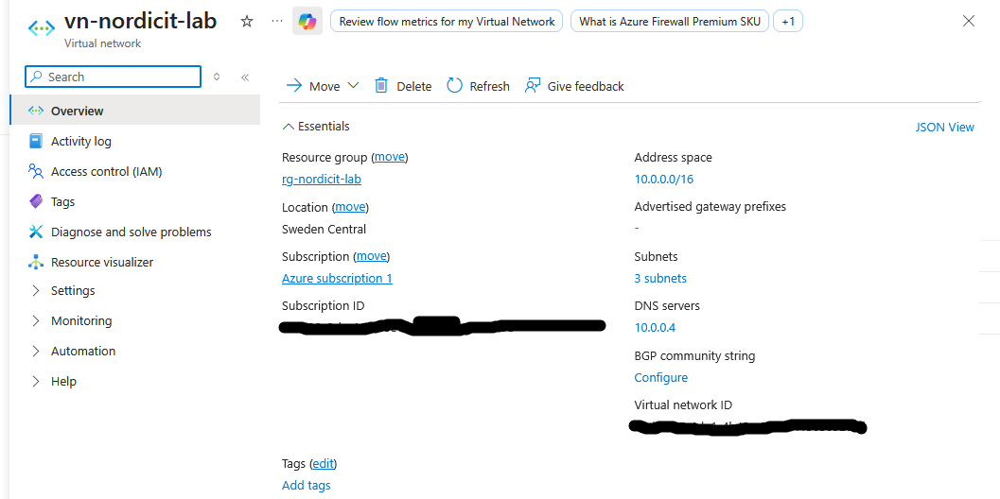
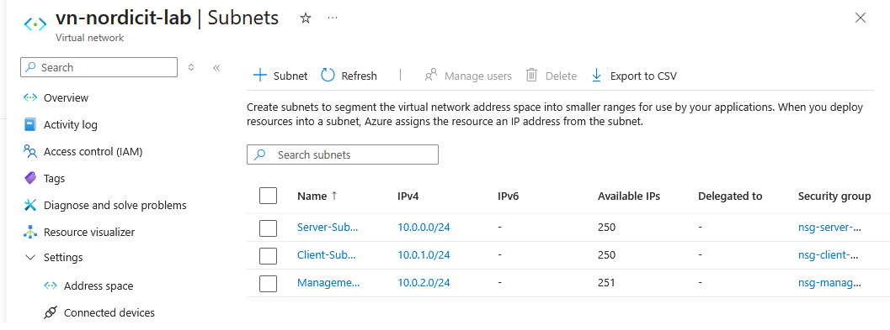
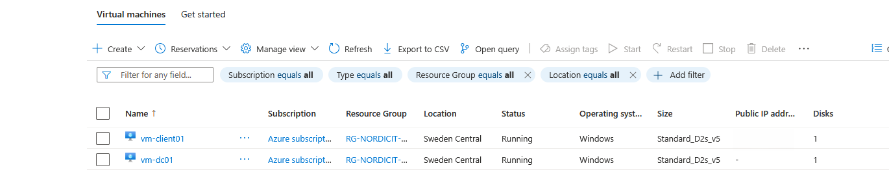
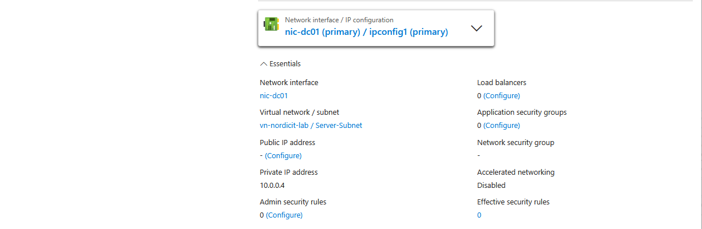
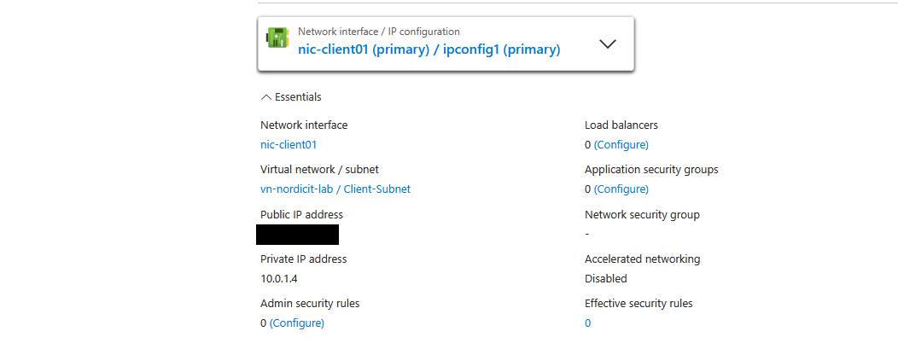

# Current Azure Environment

## Overview

This document describes the Azure resources that existed at the beginning of the Nordic IT Solutions enterprise lab.

## Subscription

The project uses an active Azure subscription managed through Azure CLI from WSL.

## Resource Group

| Property | Value |
|---|---|
| Name | rg-nordicit-lab |
| Region | Sweden Central |
| Purpose | Contains the Azure resources used by the enterprise lab |

## Virtual Network

| Property | Value |
|---|---|
| Name | vn-nordicit-lab |
| Address space | 10.0.0.0/16 |
| Region | Sweden Central |

## Subnets

| Subnet | Address range | Intended purpose |
|---|---|---|
| Server-Subnet | 10.0.0.0/24 | Windows Server, Active Directory, DNS and file services |
| Client-Subnet | 10.0.1.0/24 | Windows client devices |
| Management-Subnet | 10.0.2.0/24 | Administrative and management resources |

## Current Security State

No Network Security Groups were associated with the subnets during the initial inventory.

---

## Evidence

### Resource Group

The following screenshot shows the Azure resource group used for the project and the main Azure resources deployed inside it.

### Virtual Network

The virtual network uses the address space `10.0.0.0/16` and is connected to the domain controller DNS server at `10.0.0.4`.

### Subnets

The environment is divided into three subnets:

- Server-Subnet: `10.0.0.0/24`
- Client-Subnet: `10.0.1.0/24`
- Management-Subnet: `10.0.2.0/24`

### Virtual Machines

The environment contains two Windows virtual machines:

- `vm-dc01`
- `vm-client01`

### DC01 Network Configuration

DC01 uses the private IP address `10.0.0.4` in the Server-Subnet and does not have a public IP address.

### CLIENT01 Network Configuration

CLIENT01 uses the private IP address `10.0.1.4` in the Client-Subnet and is used as the temporary administrative jump host.

