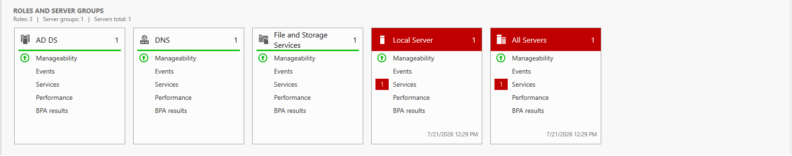
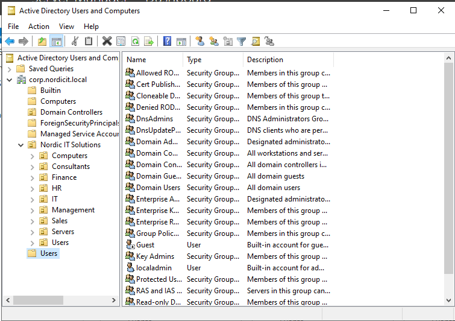
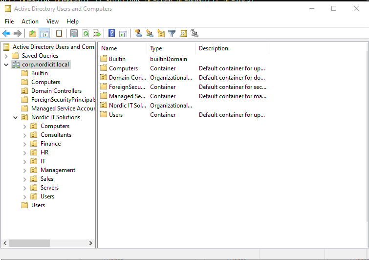
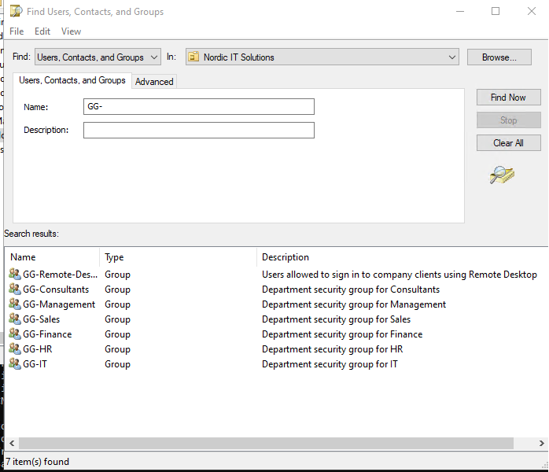
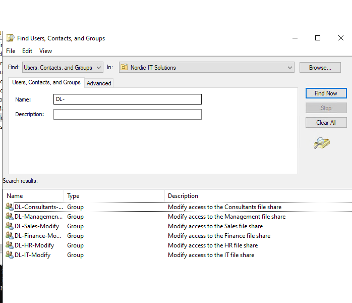
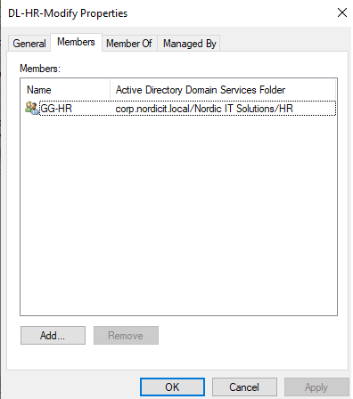
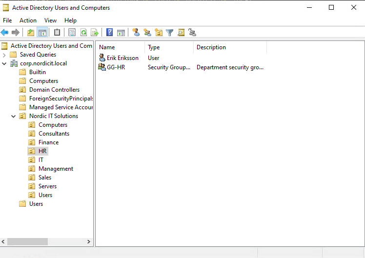
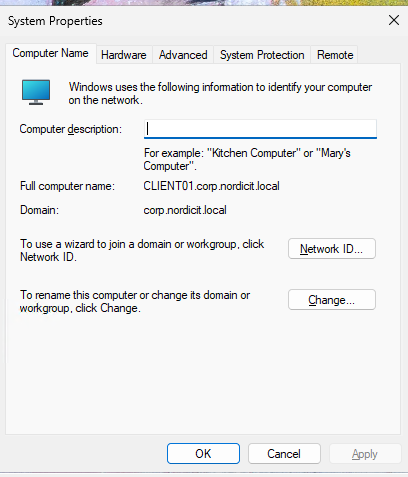
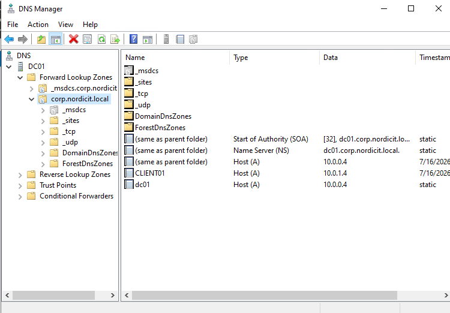

# Windows Domain Environment

## Overview

A Windows domain environment was deployed for Nordic IT Solutions in Microsoft Azure.

The environment currently consists of:

| System | Purpose | Private IP |
|---|---|---|
| DC01 | Active Directory, DNS and file services | 10.0.0.4 |
| CLIENT01 | Domain-joined Windows 11 client | 10.0.1.4 |

## Active Directory

| Property | Value |
|---|---|
| Forest | corp.nordicit.local |
| Domain | corp.nordicit.local |
| NetBIOS name | NORDICIT |
| Domain controller | DC01 |
| Global Catalog | Enabled |
| DNS server | 10.0.0.4 |

The ADWS, DNS and NTDS services were verified as running automatically.

## Organizational Units

The following organizational structure was created:

- Nordic IT Solutions
  - IT
  - HR
  - Finance
  - Sales
  - Management
  - Consultants
  - Users
  - Computers
  - Servers

## Security Groups

Global department groups:

- GG-IT
- GG-HR
- GG-Finance
- GG-Sales
- GG-Management
- GG-Consultants

Domain-local file permission groups:

- DL-IT-Modify
- DL-HR-Modify
- DL-Finance-Modify
- DL-Sales-Modify
- DL-Management-Modify
- DL-Consultants-Modify

The permission design follows the AGDLP model:

User account → Global group → Domain-local group → Permission

## Test Users

One enabled test user was created for each department:

| User | Department | Group |
|---|---|---|
| Anna Andersson | IT | GG-IT |
| Erik Eriksson | HR | GG-HR |
| Sara Svensson | Finance | GG-Finance |
| Johan Johansson | Sales | GG-Sales |
| Maria Nilsson | Management | GG-Management |
| David Karlsson | Consultants | GG-Consultants |

## File Services

Hidden SMB shares were created for every department:

- `\\DC01\IT$`
- `\\DC01\HR$`
- `\\DC01\Finance$`
- `\\DC01\Sales$`
- `\\DC01\Management$`
- `\\DC01\Consultants$`

Access is assigned through the department security groups rather than directly to individual users.

## Domain Client

CLIENT01 was configured to use DC01 as its DNS server and joined to the domain.

Connectivity to the following services was verified:

- DNS
- LDAP on TCP 389
- SMB on TCP 445
- Active Directory domain discovery

## Group Policy

A Group Policy Object named `Client Security Baseline` was linked to the Computers OU.

The policy configures:

- Machine inactivity timeout: 900 seconds
- Windows Firewall enabled for the domain profile

`gpresult` confirmed that CLIENT01 received the policy from DC01.

## Evidence

### DC01 Server Roles

DC01 is configured with the server roles required for the lab environment.

The installed roles include:

- Active Directory Domain Services
- DNS Server
- File and Storage Services

### Active Directory OU Structure

The domain contains a main Organizational Unit named `Nordic IT Solutions`.

The OU structure separates departments, computers and servers.

### Department Organizational Units

The following department OUs are included:

- IT
- HR
- Finance
- Sales
- Management
- Consultants

Additional OUs are used for:

- Users
- Computers
- Servers

### Global Security Groups

Global groups are used to organize users by department.

Examples include:

- `GG-IT`
- `GG-HR`
- `GG-Finance`
- `GG-Sales`
- `GG-Management`
- `GG-Consultants`

### Domain-Local Permission Groups

Domain-local groups are used to assign permissions to department resources.

Examples include:

- `DL-IT-Modify`
- `DL-HR-Modify`
- `DL-Finance-Modify`
- `DL-Sales-Modify`
- `DL-Management-Modify`
- `DL-Consultants-Modify`

### AGDLP Group Membership

The project uses the AGDLP permission model.

The screenshot below shows `GG-HR` as a member of `DL-HR-Modify`.

### Department Users

Users are placed in their respective department OUs and assigned to the correct global department group.

The screenshot below shows the HR user and HR group.

### Domain-Joined Client

CLIENT01 is joined to the domain `corp.nordicit.local`.

Its fully qualified computer name is:

`CLIENT01.corp.nordicit.local`

### DNS Zone

DC01 hosts the Active Directory-integrated DNS zone:

`corp.nordicit.local`

The zone contains DNS records for both DC01 and CLIENT01.

