# Test Results

## TC-NET-001 – Network Security Configuration

**Purpose:** Verify subnet and Network Security Group associations.

**Result:** PASS

Verified:

- Server-Subnet uses nsg-server-subnet
- Client-Subnet uses nsg-client-subnet
- Management-Subnet uses nsg-management-subnet
- Required DNS and management rules exist

Evidence:

- `evidence/tests/TC-NET-001-network-validation.txt`

---

## TC-AD-001 – Active Directory Health

**Purpose:** Verify the Active Directory forest, domain controller and core services.

**Expected result:**

- Domain is corp.nordicit.local
- DC01 is a Global Catalog
- ADWS, DNS and NTDS are running

**Actual result:**

- Forest: corp.nordicit.local
- Domain controller: DC01.corp.nordicit.local
- Private IP: 10.0.0.4
- Global Catalog: True
- ADWS: Running
- DNS: Running
- NTDS: Running

**Result:** PASS

---

## TC-DNS-001 – Client DNS Resolution

**Purpose:** Verify that CLIENT01 uses DC01 for DNS.

**Expected result:**

- DNS server is 10.0.0.4
- Domain and DC01 records resolve successfully

**Actual result:**

- CLIENT01 DNS server: 10.0.0.4
- corp.nordicit.local resolved to 10.0.0.4
- DC01.corp.nordicit.local resolved to 10.0.0.4

**Result:** PASS

---

## TC-FS-001 – Department Share Authorization

**Test account:** NORDICIT\erik.eriksson  
**Department:** HR

**Expected result:**

- HR share is accessible
- Files can be created in the HR share
- Finance share is inaccessible

**Actual result:**

- `\\DC01\HR$`: Accessible
- File creation in HR: Successful
- `\\DC01\Finance$`: Access denied
- File creation in Finance: Access denied

**Result:** PASS

---

## TC-GPO-001 – Client Security Baseline

**Purpose:** Verify that the client security GPO applies to CLIENT01.

**Expected result:**

- Client Security Baseline appears in gpresult
- Inactivity timeout is 900 seconds
- Domain firewall is enabled

**Actual result:**

- Policy source: DC01.corp.nordicit.local
- Client Security Baseline applied
- InactivityTimeoutSecs: 900
- Domain firewall: Enabled

**Result:** PASS

---

## TC-BACKUP-001 – DC01 Recovery Point Validation

**Purpose:** Verify that Azure Backup created a usable recovery point for DC01.

**Expected result:**

- DC01 is protected
- The latest backup completed successfully
- At least one recovery point exists

**Actual result:**

- Protection state: Protected
- Health status: Passed
- Last backup status: Completed
- Recovery point found: Yes
- Recovery point type: AppConsistent

**Result:** PASS

---

## TC-PS-001 – Active Directory Automation Script

**Purpose:** Verify that the Active Directory automation script can be run repeatedly without creating duplicate objects or changing an already correct environment.

**Expected result:**

- Existing OUs and groups are detected.
- Existing AGDLP memberships are detected.
- No duplicate objects are created.
- `WhatIf` mode performs no changes.

**Actual result:**

- All OUs were reported as existing.
- All global and domain-local groups were reported as existing.
- All AGDLP memberships were reported as existing.
- No creation or modification operations were attempted.

**Result:** PASS

---

## TC-PS-002 – Department File Share Automation

**Purpose:** Verify that the file share automation script can validate and maintain the department folders, SMB shares and permissions without creating duplicate configurations.

**Expected result:**

- All department folders are detected.
- `SYSTEM` and `BUILTIN\Administrators` have Full Control.
- Each `DL-<Department>-Modify` group has NTFS Modify permission.
- Each department group has SMB Change permission.
- All shares use access-based enumeration.
- SMB caching is disabled.
- A repeated run does not attempt unnecessary changes.

**Actual result:**

- All six department folders were detected.
- Full Control permissions were verified for `SYSTEM` and `BUILTIN\Administrators`.
- NTFS Modify permissions were verified for all department permission groups.
- SMB Change permissions were verified for all department shares.
- All shares reported `FolderEnumerationMode` as `AccessBased`.
- All shares reported `CachingMode` as `None`.
- The final `WhatIf` run did not report any required changes.

**Result:** PASS

---

## TC-PS-003 – Active Directory User Automation

**Purpose:** Verify that the user automation script can validate and maintain Active Directory users, organizational unit placement, user attributes and department group memberships.

**Expected result:**

- All required user accounts are detected.
- All accounts are enabled.
- Users are located in the correct department OUs.
- Department and job title attributes are correct.
- Each user is a member of the correct global department group.
- A repeated run does not attempt unnecessary changes.

**Actual result:**

- All six user accounts were detected.
- All accounts were enabled.
- All users were located in their correct department OUs.
- Department and job title attributes were verified.
- All department group memberships were detected.
- The final validation run reported that all user properties were correct.
- No unnecessary creation or modification operations were attempted.

**Result:** PASS

---

## Evidence

### Group Policy Validation

The `Client Security Baseline` GPO was applied successfully to CLIENT01.

The policy includes:

- Machine inactivity timeout
- Windows Defender Firewall configuration
- Centralized computer security settings

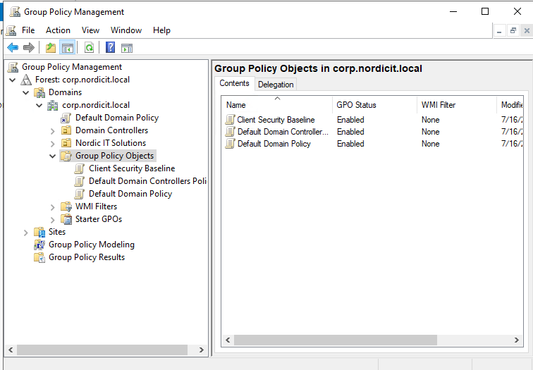

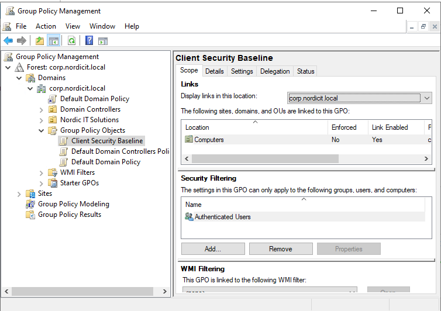

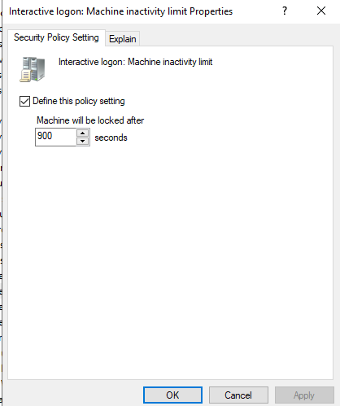

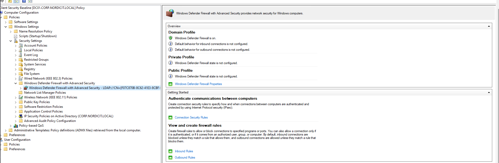

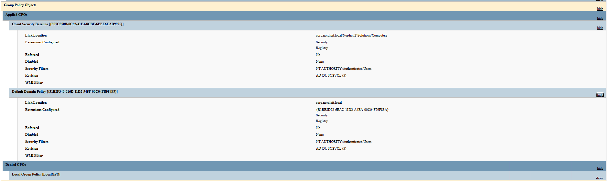

### File Share Validation

The department file-share configuration was tested using both authorized and unauthorized access attempts.

The HR user could access the HR share and create a test file.

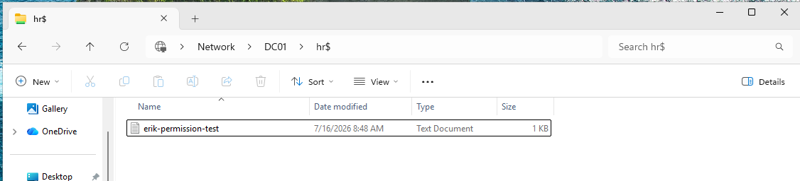

A user from another department was denied access to the HR share.

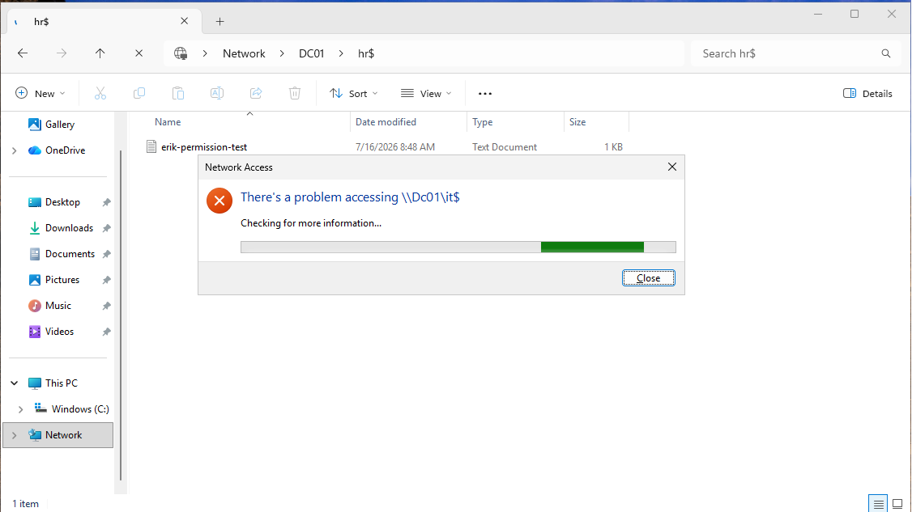

### File Service Configuration

The department folders, SMB shares and permissions were validated.

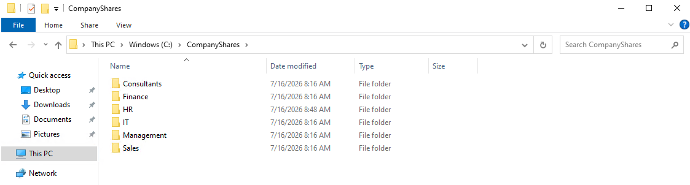

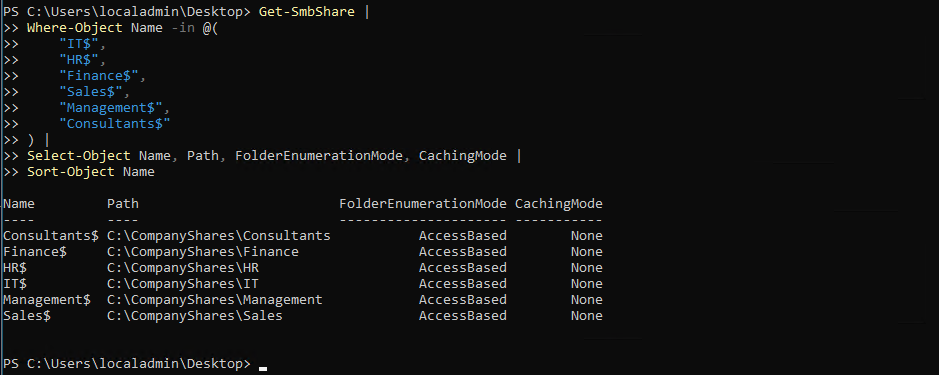

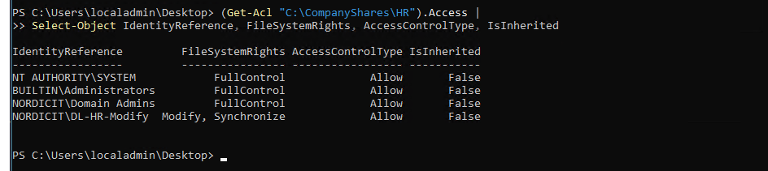

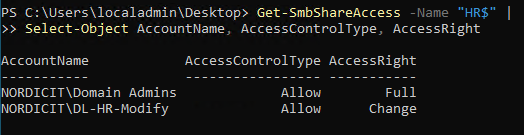

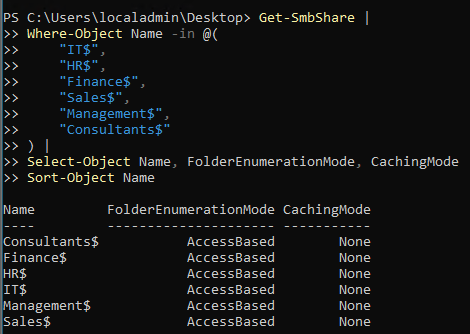

### PowerShell Validation

The PowerShell automation scripts were tested with repeated validation runs.

The tests confirmed that the scripts were idempotent and did not attempt unnecessary changes.

The following PowerShell test cases passed:

- `TC-PS-001` – Active Directory structure automation
- `TC-PS-002` – Department file-share automation
- `TC-PS-003` – Active Directory user automation
