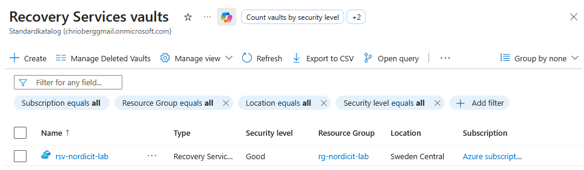
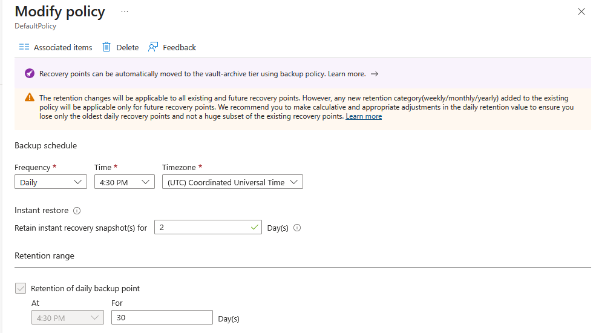
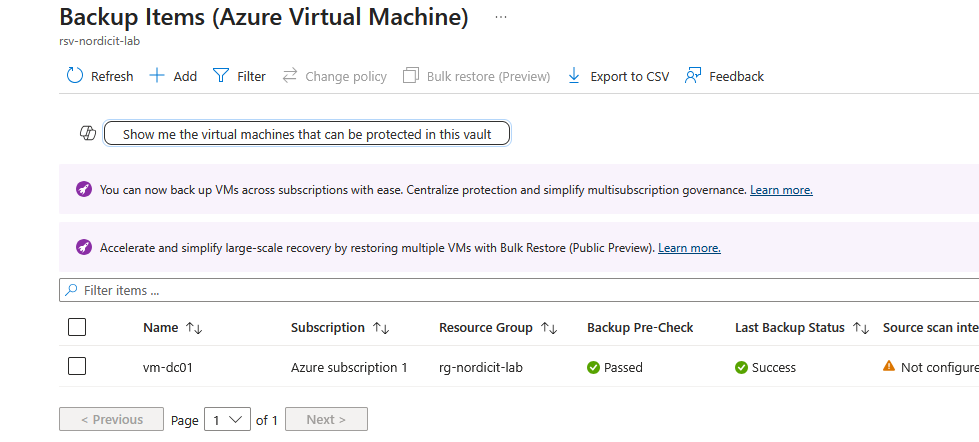
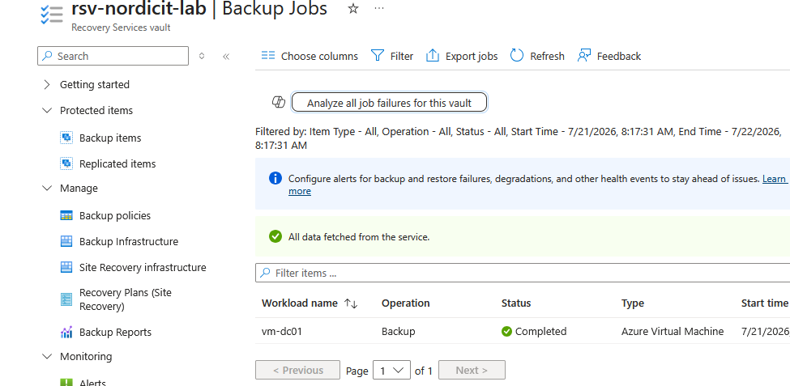
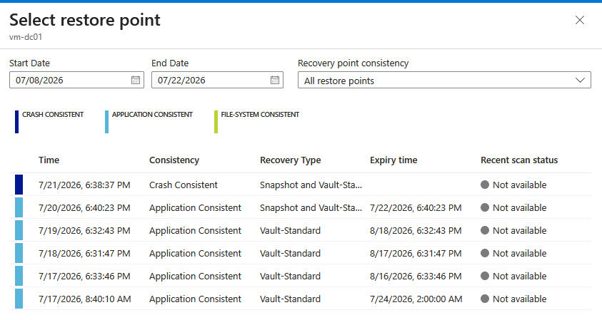
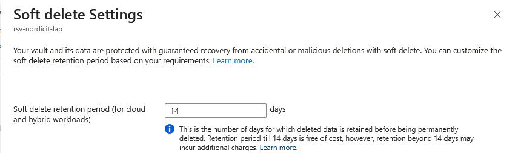

# Azure Backup

## Purpose

Azure Backup protects the domain controller VM against accidental deletion, corruption and configuration failure.

## Configuration

| Property | Value |
|---|---|
| Recovery Services vault | rsv-nordicit-lab |
| Region | Sweden Central |
| Protected VM | vm-dc01 |
| Storage redundancy | Locally Redundant |
| Soft delete | Enabled |
| Backup policy | DefaultPolicy |

## Validation

The first manual backup completed successfully.

| Check | Result |
|---|---|
| Protection state | Protected |
| Health status | Passed |
| Last backup status | Completed |
| Recovery point created | Yes |

## Result

**PASS**

DC01 is protected by Azure Backup and has a completed recovery point.

## Recovery Point Validation

The available recovery points for DC01 were listed through Azure CLI.

A recovery point was successfully found with the following properties:

| Property | Value |
|---|---|
| Protected VM | vm-dc01 |
| Recovery point available | Yes |
| Recovery point type | AppConsistent |
| Recovery point time | 2026-07-17 06:40 UTC |

An application-consistent recovery point helps preserve the state of applications and services during backup.

A full restore was not performed because it would create additional Azure resources and cost. The recovery point was instead verified as available for restoration.

## Recovery Point Test Result

**PASS**

---

## Evidence

### Recovery Services Vault

The Recovery Services vault `rsv-nordicit-lab` is deployed in the resource group `rg-nordicit-lab` in Sweden Central.

### Backup Policy

The default backup policy performs a daily backup at 4:30 PM UTC.

Instant restore snapshots are retained for 2 days and daily recovery points are retained for 30 days.

### Protected Virtual Machine

The virtual machine `vm-dc01` is protected by Azure Backup.

The backup pre-check passed and the latest backup status was successful.

### Successful Backup Job

The backup job for `vm-dc01` completed successfully.

### Application-Consistent Recovery Point

Multiple recovery points were available for `vm-dc01`.

The recovery point list included application-consistent recovery points.

### Soft Delete Protection

Soft delete is configured with a 14-day retention period.

This protects deleted backup data from accidental or malicious deletion before it is permanently removed.

