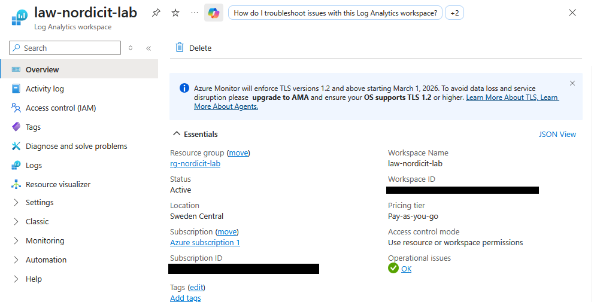
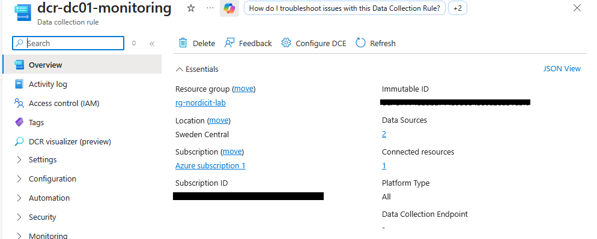
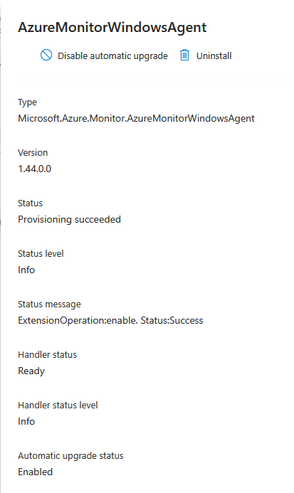
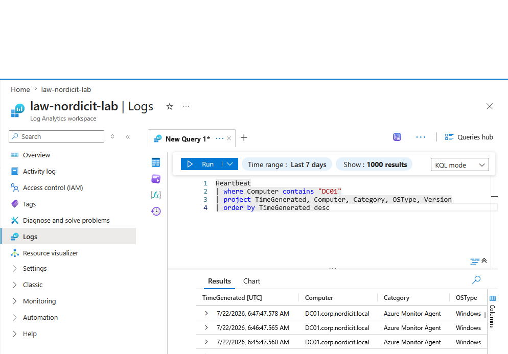
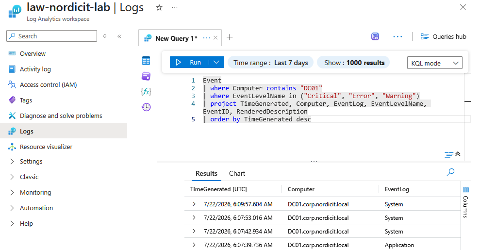
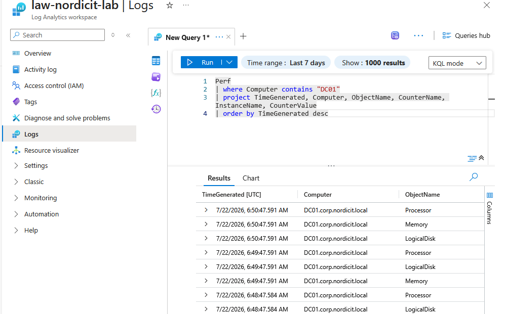
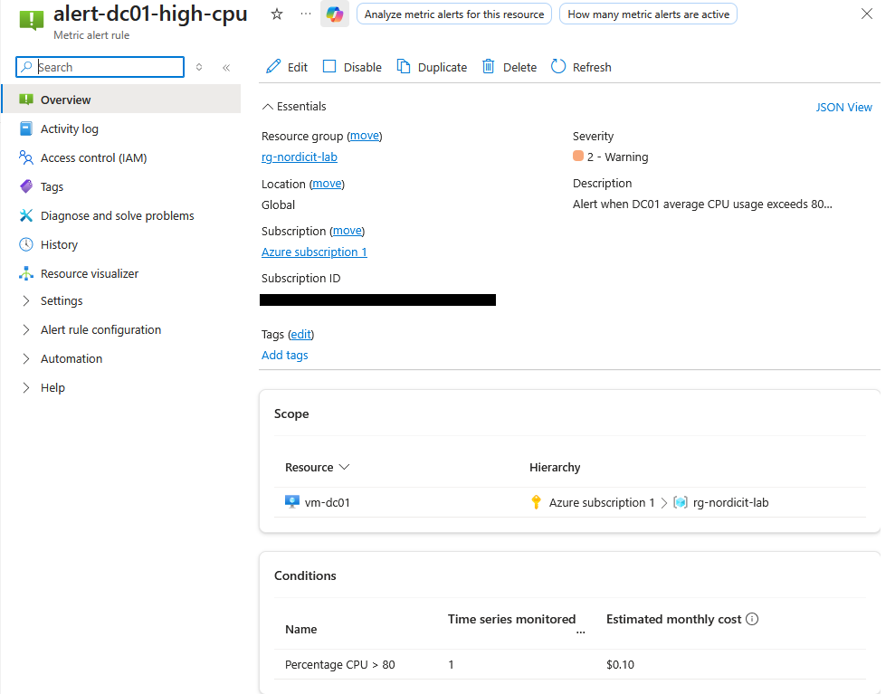

# Azure Monitor

## Purpose

Azure Monitor is used to collect operational and performance data from DC01.

The monitoring solution helps administrators detect problems, investigate events and evaluate server health.

## Architecture

The monitoring configuration consists of:

| Component | Purpose |
|---|---|
| Log Analytics workspace | Stores and queries collected monitoring data |
| Azure Monitor Agent | Collects data from the Windows Server VM |
| Data Collection Rule | Defines which logs and performance counters are collected |
| DCR association | Connects the rule to DC01 |

## Log Analytics Workspace

| Property | Value |
|---|---|
| Name | law-nordicit-lab |
| Region | Sweden Central |
| Pricing tier | PerGB2018 |
| Retention | 30 days |

The retention period was limited to 30 days to reduce unnecessary storage costs in the lab environment.

## Data Collection Rule

The Data Collection Rule is named:

`dcr-dc01-monitoring`

The rule collects selected Windows events from:

- Application
- System

Only Critical, Error and Warning events are collected.

## Performance Counters

The following performance counters are collected every 60 seconds:

- Total processor usage
- Available memory
- Free disk space

This provides basic visibility into CPU, memory and storage health without collecting unnecessary data.

## Validation

### Azure Monitor Agent

Heartbeat data was received from:

`DC01.corp.nordicit.local`

Agent version:

`1.44.0.0`

### Windows Events

Windows System warning events were successfully received in the Event table.

### Performance Data

The following data was successfully received in the Perf table:

| Counter | Example observed value |
|---|---|
| Processor usage | Approximately 4.62 percent |
| Available memory | Approximately 5775 MB |
| Free disk space | Approximately 48 percent |

## Result

**PASS**

DC01 successfully sends heartbeat, Windows event and performance data to Azure Monitor.

## Metric Alert

A metric alert named `alert-dc01-high-cpu` was created for DC01.

| Property | Value |
|---|---|
| Metric | Percentage CPU |
| Aggregation | Average |
| Threshold | Greater than 80 percent |
| Evaluation frequency | 1 minute |
| Evaluation window | 5 minutes |
| Severity | 2 |
| Enabled | Yes |

The alert provides early warning if the domain controller experiences sustained high CPU usage.

---

## Evidence

### Log Analytics Workspace

The Log Analytics workspace `law-nordicit-lab` is deployed in the resource group `rg-nordicit-lab` in Sweden Central.

The workspace is active and uses a pay-as-you-go pricing model.

### Data Collection Rule

The Data Collection Rule `dcr-dc01-monitoring` defines which Windows events and performance counters are collected from DC01.

The rule contains two data sources and is connected to one resource.

### Azure Monitor Agent

The Azure Monitor Windows Agent is installed on DC01.

The extension completed provisioning successfully and the handler status is ready.

### Heartbeat Results

Heartbeat data from `DC01.corp.nordicit.local` was successfully received in Log Analytics.

The results confirm that the Azure Monitor Agent was connected and reporting.

### Windows Event Results

Critical, error and warning events from DC01 were successfully collected from the System and Application logs.

### Performance Results

Performance data was successfully collected from DC01.

The results included processor, memory and logical disk counters.

### High CPU Alert

The metric alert `alert-dc01-high-cpu` monitors CPU usage on `vm-dc01`.

The alert uses the following configuration:

- Metric: Percentage CPU
- Condition: Greater than 80 percent
- Severity: 2
- Scope: `vm-dc01`

