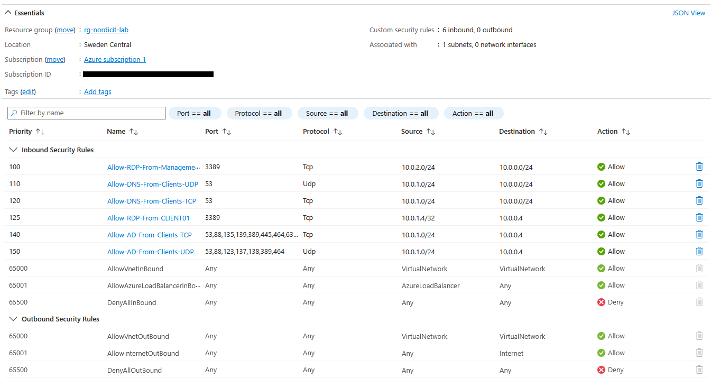
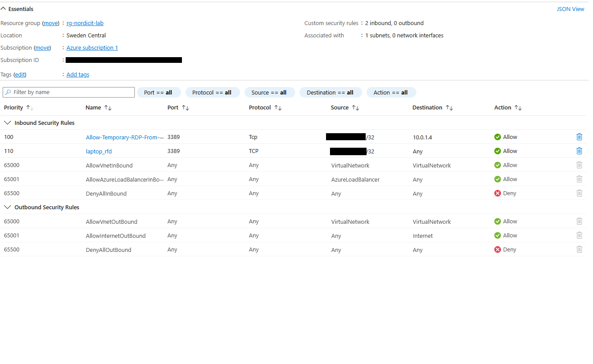
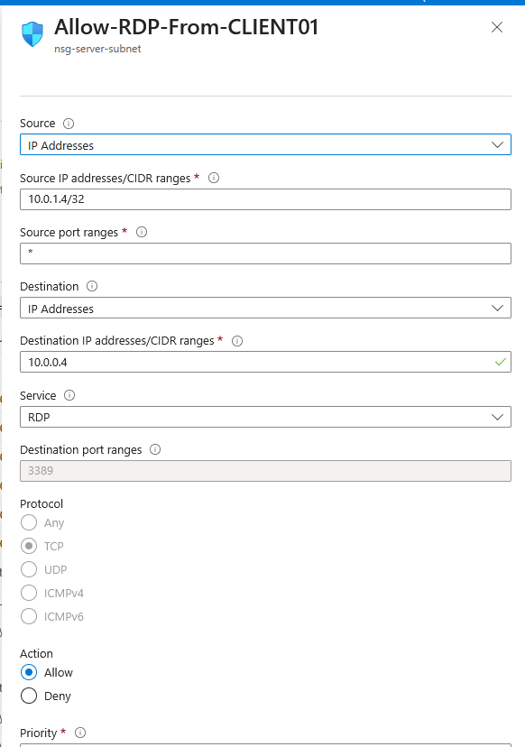
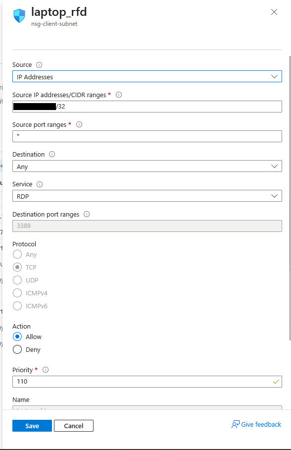
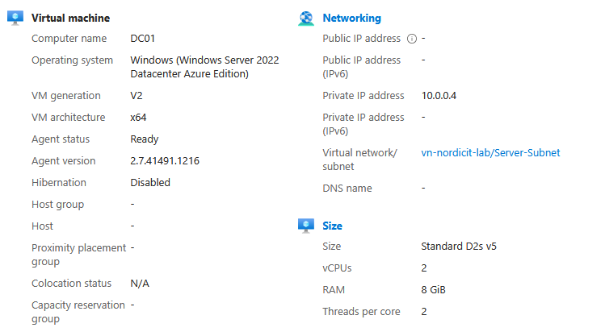

# Security Hardening

## Purpose

The initial lab deployment used temporary public RDP access to configure DC01.

After the internal administration path was verified, the direct internet exposure was removed.

## Internal Administration Path

Administrative access now follows this path:

`Administrator workstation → CLIENT01 → DC01`

CLIENT01 connects to DC01 over the private Azure network.

| Source | Destination | Protocol | Port |
|---|---|---|---|
| CLIENT01 – 10.0.1.4 | DC01 – 10.0.0.4 | TCP | 3389 |
| Management-Subnet – 10.0.2.0/24 | Server-Subnet – 10.0.0.0/24 | TCP | 3389 |

## Changes Implemented

- Verified private RDP from CLIENT01 to DC01.
- Removed the temporary home-IP RDP rule.
- Detached the public IP address from DC01.
- Deleted the unused `pip-dc01` resource.
- Retained the static private address `10.0.0.4`.

## Validation

| Check | Result |
|---|---|
| Private RDP from CLIENT01 | PASS |
| DC01 private IP retained | PASS |
| Public IP attached to DC01 | No |
| Temporary public RDP rule present | No |
| Public IP resource retained | No |

## Result

**PASS**

DC01 is no longer directly exposed to the internet through Remote Desktop.

---

## Evidence

### Network Security Groups

The environment uses separate Network Security Groups for the server, client and management subnets.

The server NSG limits inbound access and only allows required administration and Active Directory traffic.

The client NSG restricts public RDP access to specific source IP addresses using `/32`.

### Restricted Internal RDP

Internal Remote Desktop access to DC01 is limited to CLIENT01.

The rule allows traffic from:

`10.0.1.4/32`

to:

`10.0.0.4`

on TCP port `3389`.

### Restricted Public RDP

Public RDP access to CLIENT01 is restricted to a specific public source IP address using a `/32` prefix.

### No Public IP on DC01

DC01 has no public IP address.

Administrative access must pass through CLIENT01 before connecting internally to DC01.

### Group Policy Security

The `Client Security Baseline` GPO applies centralized security settings to CLIENT01.

The configured settings include:

- Windows Defender Firewall enabled
- Machine inactivity timeout
- Centralized computer policy management

### Department Access Control

Department access is controlled using the AGDLP model.

Global department groups are nested inside domain-local permission groups.

The HR permission group has NTFS Modify access and SMB Change access to the HR share.

### Access-Based Enumeration

All department shares use Access-Based Enumeration and have offline caching disabled.

### Access Validation

The authorized HR user could access the HR share.

A user from another department was denied access.

