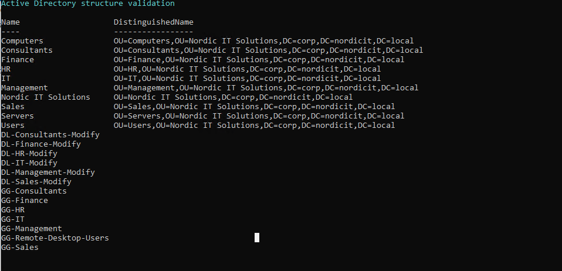
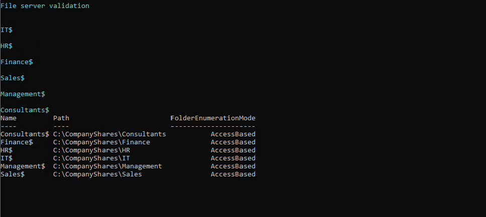
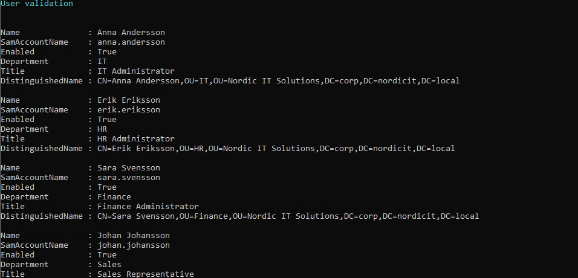
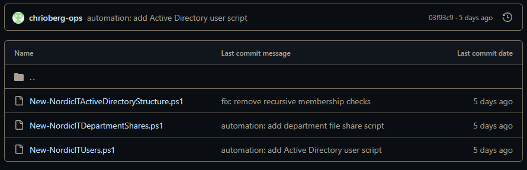

# PowerShell Automation

## Overview

PowerShell was used to automate repetitive administrative tasks in the Azure enterprise lab.

The purpose of the automation was to improve consistency, reduce manual errors and demonstrate how a system administrator can manage Active Directory and file services more efficiently.

## Implemented Scripts

### Active Directory Structure

File:

`scripts/powershell/New-NordicITActiveDirectoryStructure.ps1`

The script validates and maintains:

- Organizational Units
- Global department groups
- Domain-local permission groups
- AGDLP group memberships

The script is idempotent. Existing objects are detected before any creation or modification is attempted.

### Department File Shares

File:

`scripts/powershell/New-NordicITDepartmentShares.ps1`

The script validates and maintains:

- Department folders
- Hidden SMB shares
- NTFS permissions
- SMB permissions
- Access-Based Enumeration
- Disabled offline caching

Each department permission group receives the required access without assigning permissions directly to individual users.

### Active Directory Users

File:

`scripts/powershell/New-NordicITUsers.ps1`

The script validates and maintains:

- Department user accounts
- Correct OU placement
- Enabled account state
- Department attributes
- Job title attributes
- Global group memberships

## Design Principles

The scripts were designed around the following principles:

- Idempotent execution
- Clear validation output
- Reusable configuration
- Consistent naming
- Reduced manual administration
- Support for safe testing

## Testing Method

Each script was executed against the completed environment.

A repeated validation run confirmed that existing objects were detected and that no unnecessary changes were attempted.

Where supported, `WhatIf` mode was used to verify that the scripts would not modify an already correct environment.

## Test Results

| Test case | Script area | Result |
|---|---|---|
| TC-PS-001 | Active Directory structure | PASS |
| TC-PS-002 | Department file shares | PASS |
| TC-PS-003 | Active Directory users | PASS |

Detailed results are documented in:

`docs/04-test-results.md`

## Evidence

### Active Directory Structure Script

The validation run confirmed that the required OUs, groups and AGDLP memberships already existed.

### Department File Share Script

The validation run confirmed that folders, shares, NTFS permissions, SMB permissions, Access-Based Enumeration and caching settings were correct.

### Active Directory User Script

The validation run confirmed that all users were enabled, located in the correct OUs and assigned to the correct groups.

### Repository Structure

The PowerShell scripts are stored in the project repository for version control, reuse and documentation.

## Result

**PASS**

The PowerShell automation successfully validated the implemented Active Directory, user and file-service configuration without creating duplicate objects or attempting unnecessary changes.
