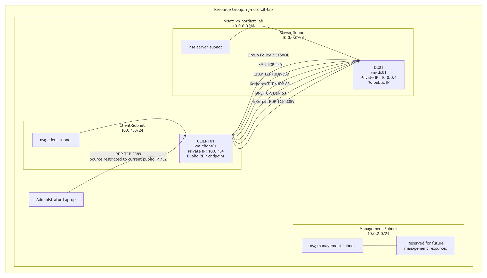
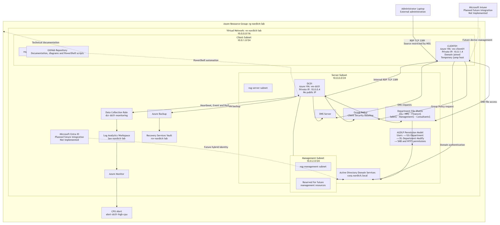
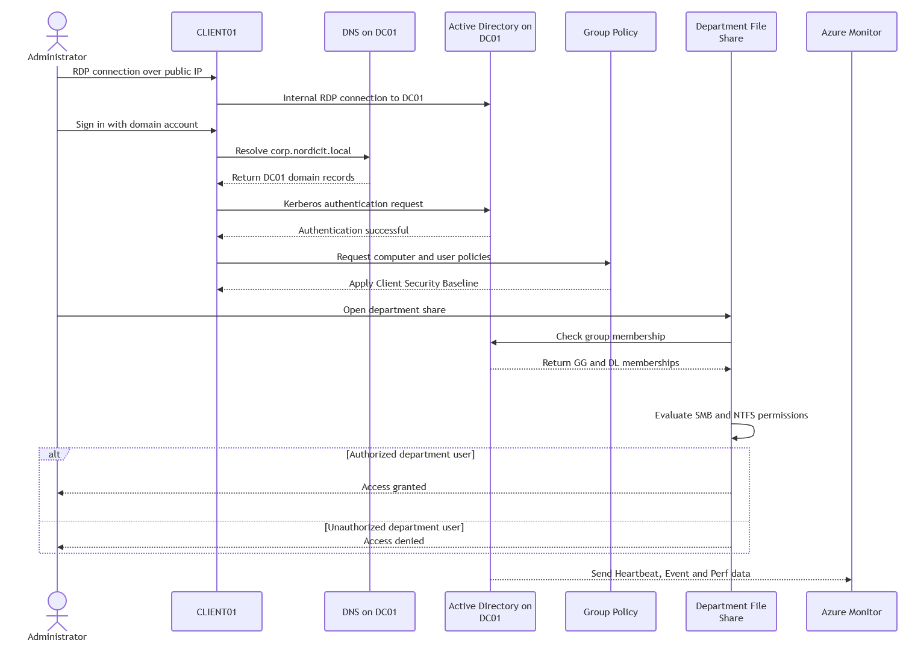

# Project Diagrams

## Overview

The project includes three diagrams that explain the technical design, network layout and communication flow of the Azure enterprise environment.

The diagrams are stored in:

```text
diagrams/
```

Each diagram is available as:

- PNG for GitHub, reports and presentations
- Draw.io source file for future editing

---

## 1. Network Diagram

Files:

```text
diagrams/azure-enterprise-network-diagram.png
diagrams/azure-enterprise-network-diagram.drawio
```

The network diagram shows:

- Resource group `rg-nordicit-lab`
- Virtual network `vn-nordicit-lab`
- VNet address space `10.0.0.0/16`
- Server-Subnet `10.0.0.0/24`
- Client-Subnet `10.0.1.0/24`
- Management-Subnet `10.0.2.0/24`
- DC01 at `10.0.0.4`
- CLIENT01 at `10.0.1.4`
- Network Security Groups
- Public RDP access to CLIENT01
- Internal RDP access from CLIENT01 to DC01
- DNS traffic
- Kerberos traffic
- LDAP traffic
- SMB traffic
- Group Policy and SYSVOL traffic
- No public IP address on DC01

### Purpose

The purpose of the network diagram is to show how the environment is segmented and how traffic flows between the administrator, Windows client and domain controller.



---

## 2. System Architecture Diagram

Files:

```text
diagrams/azure-enterprise-system-architecture.png
diagrams/azure-enterprise-system-architecture.drawio
```

The system architecture diagram shows:

- Administrator laptop
- Azure resource group
- Azure virtual network
- Three subnets
- DC01
- CLIENT01
- Active Directory Domain Services
- DNS
- Group Policy
- Department file shares
- AGDLP permissions
- Azure Backup
- Recovery Services Vault
- Azure Monitor
- Log Analytics Workspace
- Data Collection Rule
- CPU alert
- GitHub repository
- Microsoft Entra ID as a planned integration
- Microsoft Intune as a planned integration

### Purpose

The purpose of the architecture diagram is to provide a complete overview of how the implemented infrastructure components and supporting services are connected.

Microsoft Entra ID and Microsoft Intune are included as planned future integrations and are clearly marked as not implemented because of tenant and licensing limitations.



---

## 3. UML Sequence Diagram

Files:

```text
diagrams/azure-enterprise-uml-sequence.png
diagrams/azure-enterprise-uml-sequence.drawio
```

The UML sequence diagram describes a typical user and administration flow.

The process includes:

1. Administrator connects to CLIENT01 using Remote Desktop.
2. CLIENT01 connects internally to DC01.
3. A domain user signs in.
4. CLIENT01 sends a DNS request to DC01.
5. DNS returns the domain controller records.
6. CLIENT01 sends a Kerberos authentication request.
7. Active Directory validates the user.
8. CLIENT01 requests Group Policy.
9. The Client Security Baseline is applied.
10. The user requests access to a department file share.
11. Group membership is checked.
12. SMB and NTFS permissions are evaluated.
13. Access is granted or denied.
14. Heartbeat, Event and Performance data are sent to Azure Monitor.

### Purpose

The purpose of the sequence diagram is to show the order of communication between the administrator, client, DNS, Active Directory, Group Policy, file services and Azure Monitor.



---

## Design Decisions

The diagrams were updated to reflect the actual implemented environment.

Important corrections include:

- Correct subnet ranges
- Correct private IP addresses
- Removal of public access to DC01
- CLIENT01 shown as the temporary jump host
- Azure Bastion removed because it was not implemented
- Microsoft Entra ID and Intune marked as planned
- Backup connected to DC01
- Azure Monitor connected to DC01
- Department shares and AGDLP permissions included
- Actual Azure resource names included

---

## Status

All required diagrams have been completed.

| Diagram | PNG | Draw.io source | Status |
|---|---|---|---|
| Network diagram | Yes | Yes | Complete |
| System architecture diagram | Yes | Yes | Complete |
| UML sequence diagram | Yes | Yes | Complete |

**Status:** Complete
