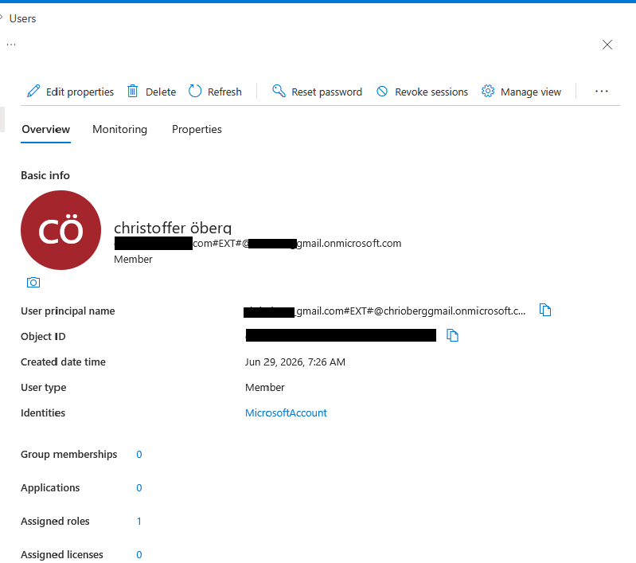
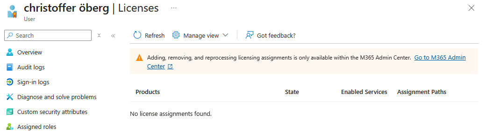
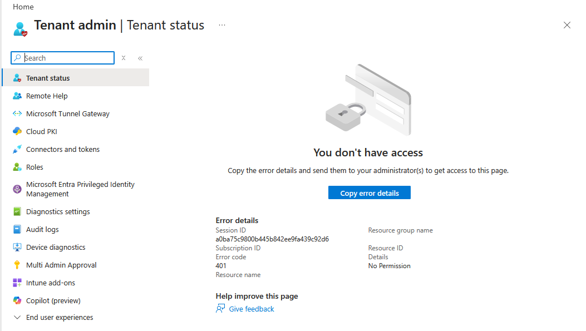
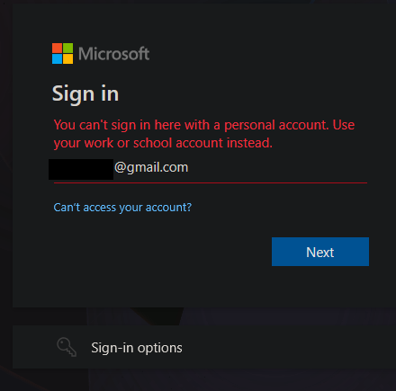

# Microsoft Intune and Entra ID Licensing Limitation

## Overview

The original project plan included Microsoft Entra ID and Microsoft Intune as part of the hybrid identity and device-management solution for Nordic IT Solutions.

The intended design was to synchronize the Active Directory domain `corp.nordicit.local` with Microsoft Entra ID and manage Windows devices through Microsoft Intune.

During implementation, the available tenant, account permissions and licenses were investigated. The result showed that the current Azure account could manage Azure infrastructure resources, but did not have the required Microsoft Intune permissions or licenses.

Because of this, the practical Intune implementation could not be completed in the available tenant.

---

## Current Tenant and Account Situation

The Azure subscription is connected to a Microsoft Entra tenant named `Standardkatalog`.

The account used for the project signs in with the user's primary Microsoft account.

Inside the Microsoft Entra tenant, the account is represented by a user principal name containing `#EXT#` and uses `MicrosoftAccount` as its identity provider.

The account has the user type `Member`, but authentication is performed through an identity outside the tenant.

The account could manage Azure resources such as:

- Virtual machines
- Virtual networks
- Network Security Groups
- Recovery Services Vault
- Azure Monitor
- Log Analytics Workspace

However, Azure subscription permissions and Microsoft Entra tenant permissions are separate authorization systems.

Access to an Azure subscription does not automatically provide permission to:

- Administer Microsoft Entra ID
- Assign Microsoft 365 or Intune licenses
- Configure Microsoft Intune
- Enroll devices into Intune
- Configure automatic MDM enrollment
- Create internal tenant users
- Manage Microsoft 365 licensing

---

## Intune Administration Test

The Microsoft Intune admin center was opened using the current account.

The Tenant Status page returned:

```text
Error code: 401
Details: No Permission
```

This confirmed that the account did not have permission to administer Microsoft Intune in the connected tenant.

---

## Licensing Limitation

The user account had no assigned Microsoft 365 or Intune licenses.

The Microsoft Entra license page displayed:

```text
No license assignments found
```

Microsoft 365 Admin Center also rejected the personal Microsoft account and required a work or school account.

Because of this, the current account could not manage or assign the licenses required for Microsoft Intune.

---

## Project Decision

A simulated or misleading Intune implementation was not included.

Instead, the limitation was documented as a real-world dependency involving:

- Tenant ownership
- Microsoft Entra roles
- Microsoft Intune permissions
- Microsoft 365 and Intune licensing
- Device enrollment authority
- Access to an organizational work or school account

This provides a more accurate result than claiming that Intune was implemented when the required tenant access was unavailable.

---

## Evidence

### External Microsoft Account

The account is represented in the Microsoft Entra tenant by a user principal name containing `#EXT#`.

The identity provider is shown as `MicrosoftAccount`, and no licenses are assigned.



### No Assigned Licenses

The Microsoft Entra license page confirms that no licenses are assigned to the account.



### Intune Permission Error

The Microsoft Intune admin center returned a 401 permission error.



### License Administration Limitation

Microsoft 365 Admin Center did not accept the personal Microsoft account used for the project.

The sign-in page required a work or school account, which prevented the current account from managing Microsoft 365 and Intune licenses.



---

## Result

**NOT IMPLEMENTED — DOCUMENTED LIMITATION**

The technical design remains valid, but practical implementation was blocked by tenant permissions, account type and licensing limitations.

The limitation affected Microsoft Entra and Intune administration only. The implemented Azure infrastructure, Active Directory environment, networking, security, backup, monitoring and PowerShell automation remained functional.
